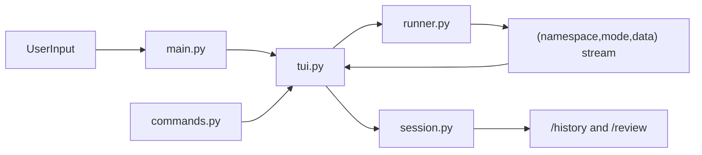

# TUI Layout and History Review Refresh Guide

**Guide**: IG-010
**Title**: TUI Layout, Streaming, and Reviewable History Refresh
**Created**: 2026-03-13
**Related RFCs**: RFC-0001, RFC-0002, RFC-0003
**Supersedes**: Refines the UX portions of IG-007

## Overview

This guide documents a conservative redesign of the Soothe CLI TUI so it remains aligned with
RFC-0003 while becoming substantially more usable during long-running sessions. The redesign keeps
the native `(namespace, mode, data)` stream contract and Rich-based rendering model, but changes
the presentation from a single stacked status feed into a persistent dashboard.

The refresh has three primary goals:

1. Show the assistant response live while work is still in progress.
2. Preserve operational visibility for plans, subagents, and protocol/tool events.
3. Make both conversation history and action history reviewable inside the CLI.

## Prerequisites

- [x] RFC-0001 accepted (System Conceptual Design)
- [x] RFC-0002 accepted (Core Modules Architecture Design)
- [x] RFC-0003 accepted (CLI TUI Architecture Design)
- [x] IG-007 completed (CLI TUI Implementation)

## Scope

This guide covers the following files:

- `src/soothe/cli/tui.py`
- `src/soothe/cli/session.py`
- `src/soothe/cli/commands.py`
- `src/soothe/cli/runner.py`
- `src/soothe/cli/main.py`
- `tests/unit_tests/test_cli_session.py`

## Architectural Position

The redesign does not introduce a new event system. It refines how the existing runner and TUI
cooperate.

Key invariants preserved from RFC-0003:

- `SootheRunner` remains the orchestration layer.
- The TUI remains presentation-oriented and does not call protocols directly.
- `soothe.*` custom events remain the only Soothe-specific stream extension.
- Final answer rendering still happens after the live block, but live answer preview is now
  visible during streaming.

## UX Design

### Layout

Replace the old `Group`-based stacked output with a persistent two-column `rich.layout.Layout`:

- Left column: `Conversation` panel
- Right column: `Plan`, `Subagents`, and `Recent Actions`
- Bottom row: compact status/footer panel

The left column is the primary reading surface. The right column is the operator dashboard.

### Streaming answer behavior

The assistant text should be visible as tokens arrive instead of being hidden until the stream
ends. To keep the layout stable on long answers:

- accumulate the canonical full response in memory
- render only the most recent bounded window of lines in the live panel
- preserve full post-run Markdown rendering after the live session completes

### Reviewable history

Two distinct histories should be surfaced:

- Conversation history: user prompts and assistant replies
- Action history: protocol events and subagent/tool activity

This is intentionally separate from the on-screen live panels:

- live panels optimize for current execution
- review commands optimize for retrospective inspection

## Module Changes

### 1. `session.py`

Extend `SessionLogger` from an event-only JSONL writer into a lightweight session record store.

Add:

- `log_user_input(text)`
- `log_assistant_response(text)`
- `read_recent_records(limit)`
- `recent_conversation(limit)`
- `recent_actions(limit)`

Record format:

- `kind: "conversation"` for user/assistant turns
- `kind: "event"` for existing `custom`-mode event records

This keeps the implementation append-only and audit-friendly while enabling in-terminal review.

### 2. `commands.py`

Add review-oriented slash commands:

- `/history` -- show recent prompt history from `InputHistory`
- `/review` -- show recent conversation and recent actions together
- `/review conversation` -- conversation-only review
- `/review actions` -- action-only review

These commands should use existing Rich tables/panels and avoid introducing a modal/full-screen
browser-like interaction model.

### 3. `tui.py`

Refactor the display builder into panel-specific rendering helpers:

- `_render_answer_panel()`
- `_render_plan_panel()`
- `_render_subagent_panel()`
- `_render_activity_panel()`
- `_render_status_panel()`

`TuiState` should include enough persistent state to support stable panels:

- `full_response`
- `activity_lines`
- `current_plan`
- `subagent_tracker`
- `thread_id`
- `last_user_input`
- `errors`

The TUI should also:

- log user input once the session starts
- log final assistant responses after a run completes
- update the session logger thread ID as soon as `soothe.thread.created`,
  `soothe.thread.resumed`, or `soothe.session.started` is observed

### 4. `runner.py`

The review model is only trustworthy if thread identity is trustworthy.

Refine thread handling so:

- requested thread IDs are honored
- existing threads are resumed when possible
- `soothe.thread.resumed` is emitted for true resume flows
- a new thread is only created when no valid resume target exists

Also expose a public setter for the active thread ID:

- `set_current_thread_id(thread_id)`

This avoids external mutation of `_current_thread_id`.

### 5. `main.py`

Use the runner setter rather than direct private-state mutation when launching TUI mode with a
preselected thread.

## Event Coverage Expectations

The refreshed TUI should visibly handle these event families:

- `soothe.session.*`
- `soothe.thread.*`
- `soothe.context.*`
- `soothe.memory.*`
- `soothe.plan.*`
- `soothe.policy.*`
- `soothe.error`

Minimum layout-visible improvements:

- `soothe.thread.saved` should appear in the activity/review surfaces
- `soothe.thread.resumed` should be distinct from thread creation
- `soothe.plan.step_started` and `soothe.plan.step_completed` should update plan state if emitted

## Testing Strategy

### Unit tests

Add focused tests for the new reviewability behavior:

- `SessionLogger` writes and reads mixed conversation/event records
- `/history` renders recent prompt history
- `/review` renders both conversation and action summaries

### Regression tests

Retain or add coverage confirming:

- thread resume semantics still work
- durability behavior remains unchanged for create/resume/archive flows
- the new public runner setter can replace direct private-field mutation

## Verification

- [ ] Live TUI shows assistant output incrementally during streaming
- [ ] Conversation panel remains readable during long tool-heavy runs
- [ ] Recent action panel shows bounded, compact operational summaries
- [ ] `/history` shows recent prompts from persistent input history
- [ ] `/review` shows both user/assistant turns and custom event history
- [ ] Resumed threads emit `soothe.thread.resumed`
- [ ] `soothe.thread.saved` is visible in activity history
- [ ] No private `runner._current_thread_id` mutation remains in main TUI launch flow
- [ ] `ruff check` passes on touched files
- [ ] Targeted CLI/session tests pass

## Compatibility Notes

- This guide is a presentation-layer refinement, not a protocol redesign.
- Existing session logs remain append-only JSONL; new records simply add `kind`, `role`, and
  `text` fields for conversation entries.
- The redesign is intentionally conservative: it does not replace Rich, the native stream format,
  or the post-run Markdown answer rendering.

## Related Documents

- [RFC-0003](../specs/RFC-0003.md) - CLI TUI Architecture Design
- [RFC-0001](../specs/RFC-0001.md) - System Conceptual Design
- [RFC-0002](../specs/RFC-0002.md) - Core Modules Architecture Design
- [IG-007](./007-cli-tui-implementation.md) - CLI TUI Implementation
