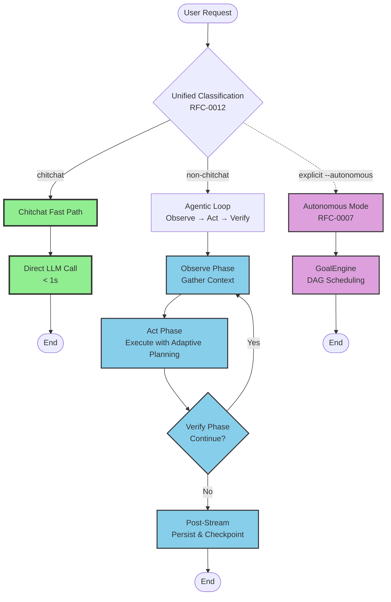
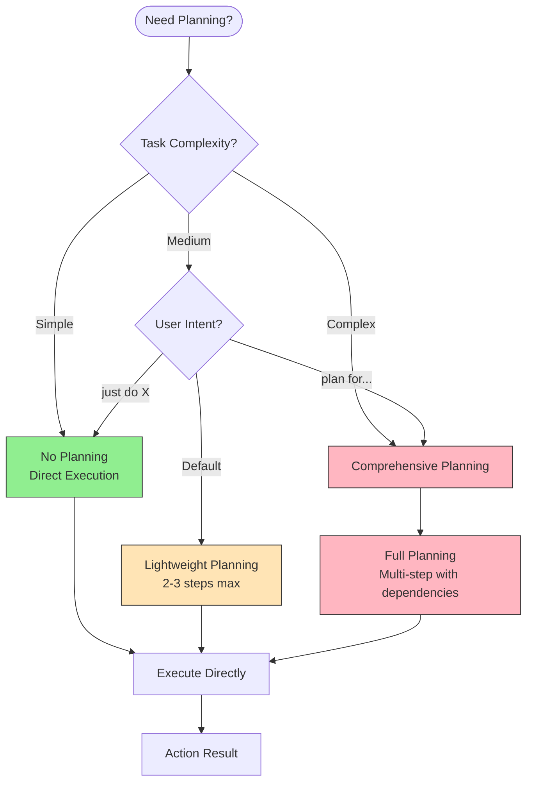
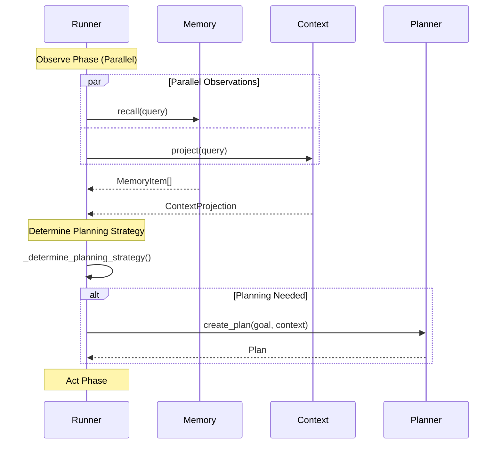
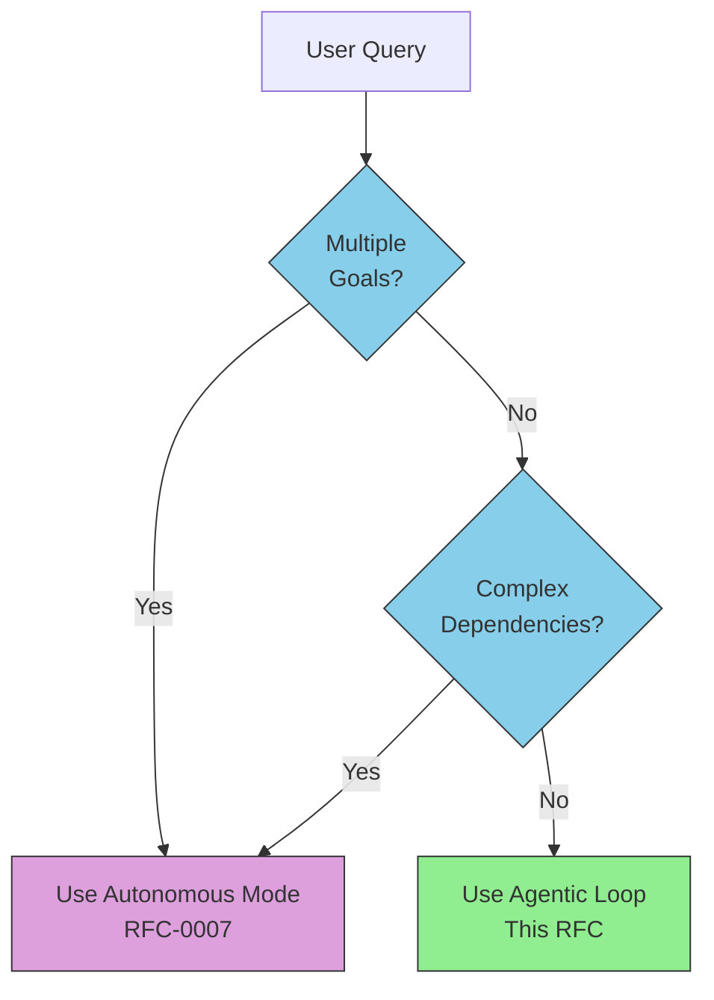

# RFC-0008: Agentic Loop Execution Architecture

**RFC**: 0008
**Title**: Agentic Loop Execution Architecture
**Status**: Draft
**Created**: 2026-03-16
**Updated**: 2026-03-22
**Related**: RFC-0001, RFC-0002, RFC-0003, RFC-0007, RFC-0009, RFC-0012

## Abstract

This RFC defines Soothe's default execution architecture based on the **Agentic Loop** pattern: **Observe → Act → Verify**. This iterative refinement loop replaces the previous single-pass execution model, enabling automatic adaptation to task complexity while maintaining sub-second responses for simple queries through a chitchat fast path. The architecture uses unified classification (RFC-0012) to drive adaptive planning strategies, providing intelligent iteration without the overhead of explicit goal management required in Autonomous mode (RFC-0007).

## Motivation

### Problem Statement

Before this RFC, Soothe used a **single-pass execution model** where queries received one-shot processing:

1. **Classification** → Determine complexity
2. **Planning** → Create plan (always for medium/complex)
3. **Execution** → Run once
4. **Reflection** → Post-hoc analysis

**Limitations**:
- No iterative refinement for tasks that benefit from multiple attempts
- Users must explicitly opt into Autonomous mode (RFC-0007) for iteration
- Planning always triggered for medium/complex queries, even when unnecessary
- No feedback loop to adapt execution based on initial results

### Design Goals

1. **Default iteration**: Non-chitchat queries automatically benefit from iterative refinement
2. **Adaptive planning**: Planning triggered by complexity and context, not just classification
3. **Sub-second chitchat**: Simple queries remain fast (direct LLM, no overhead)
4. **Lighter than autonomous**: No goal engine overhead for standard tasks
5. **Intelligent adaptation**: Observe results, verify quality, iterate as needed

### Relationship to RFC-0007 (Autonomous Mode)

**Two complementary execution modes**:

| Aspect | Agentic Loop (This RFC) | Autonomous Mode (RFC-0007) |
|--------|-------------------------|----------------------------|
| **Trigger** | Default for all non-chitchat queries | Explicit `--autonomous` flag |
| **Goal Management** | Implicit (thread-scoped) | Explicit GoalEngine with DAG |
| **Iteration** | Verify-based continuation | Reflection-based goal completion |
| **Planning** | Adaptive (complexity-driven) | Always comprehensive |
| **Overhead** | Minimal (stateless) | Goal lifecycle, persistence |
| **Use Case** | Standard tasks (90%) | Complex multi-goal workflows (10%) |

**Refer to RFC-0007 for**: Goal DAG scheduling, hierarchical goals, goal directives, multi-threaded parallel execution.

## Architecture Overview

### Two Execution Modes



### Agentic Loop Phases

#### Phase 1: Observe

**Purpose**: Gather context and determine execution strategy.

**Operations**:
- **Classification** (RFC-0012): Determine complexity and routing
- **Context Projection**: Retrieve relevant context entries
- **Memory Recall**: Fetch relevant memories
- **Policy Check**: Validate permissions
- **State Analysis**: Analyze cumulative iteration results

**Outputs**:
- `task_complexity`: simple | medium | complex
- `planning_strategy`: none | lightweight | comprehensive
- `context_projection`: Relevant context
- `recalled_memories`: Related memories
- `observation_summary`: Structured observation results

**Adaptive Observation Strategy**:

| Complexity | Context | Memory | Classification | Duration |
|------------|---------|--------|----------------|----------|
| Simple | ❌ Skip | ❌ Skip | ✅ Fast | < 100ms |
| Medium | ✅ Parallel | ✅ Parallel | ✅ Full | 1-2s |
| Complex | ✅ Full | ✅ Full | ✅ Full | 2-3s |

#### Phase 2: Act

**Purpose**: Execute actions with adaptive planning.

**Planning Decision Tree**:



**Planning Strategies**:

1. **None** (Simple queries):
   - Skip planning entirely
   - Direct LLM execution
   - Single-step actions
   - Examples: "read file X", "list files"

2. **Lightweight** (Medium queries):
   - 2-3 steps maximum
   - Simple sequential execution
   - No DAG analysis
   - Examples: "debug the error", "add tests for X"

3. **Comprehensive** (Complex queries):
   - Full multi-step planning
   - DAG-based step scheduling (RFC-0009)
   - Parallel execution of independent steps
   - Examples: "refactor auth system", "migrate to microservices"

**Execution Flow**:
- Single-step → Direct LangGraph stream
- Multi-step → Step scheduler (RFC-0009) with DAG execution
- Parallel execution for independent steps
- Concurrency control via `ConcurrencyController`

#### Phase 3: Verify

**Purpose**: Evaluate results and decide iteration continuation.

**Verification Process**:

1. **Reflection** (PlannerProtocol):
   - Analyze step results
   - Assess goal completion
   - Identify remaining work
   - Generate feedback

2. **Quality Check**:
   - Task completion signals in response
   - Error detection
   - Missing information
   - Quality metrics

3. **Decision**:
   - `should_continue`: Boolean decision
   - `reasoning`: Why continue or stop
   - `next_focus`: What to work on next iteration

**Verification Strictness Levels**:

| Strictness | Continue Criteria | Use Case |
|------------|-------------------|----------|
| **Lenient** | Any indication of incomplete work | Exploratory tasks |
| **Moderate** (default) | Clear need + quality check | Standard tasks |
| **Strict** | Strong evidence of incompleteness | Critical tasks |

**Continuation Signals**:
- **Positive**: "need to verify", "should test", "missing X"
- **Negative**: "task complete", "done", "finished successfully"
- **Errors**: Exception, timeout, tool failure (may require retry)

### Iteration Control

**Maximum Iterations**:
- Default: 3 iterations
- Configurable per request
- Hard limit to prevent infinite loops

**Early Termination**:
- Task completion detected in response
- User interruption
- Error threshold exceeded
- Resource limits reached

**Iteration Record**:

```python
class IterationRecord(BaseModel):
    iteration: int
    planning_strategy: str  # none | lightweight | comprehensive
    observation_summary: str
    actions_taken: str
    verification_result: str
    should_continue: bool
    duration_ms: int
```

Stored in ContextProtocol for cross-iteration memory.

## Performance Optimization

### Chitchat Fast Path

**Preserved from original RFC-0008**: Sub-second responses for simple queries.

**Optimization**: Skip all protocols and planning, direct LLM call.

**Characteristics**:
- Token count < 30
- Greetings, simple questions, acknowledgments
- No state persistence
- No memory/context operations
- Single LLM call with minimal prompt

**Latency Target**: < 500ms (P90), < 800ms (P99)

### Adaptive Resource Loading

**Lazy loading based on complexity**:

| Resource | Chitchat | Simple | Medium | Complex |
|----------|----------|--------|--------|---------|
| Memory Recall | ❌ Skip | ❌ Skip | ✅ Parallel | ✅ Full |
| Context Projection | ❌ Skip | ❌ Skip | ✅ Parallel | ✅ Full |
| Planning | ❌ Skip | ❌ Skip | ✅ Light/Full | ✅ Full |
| Checkpoint | ❌ Skip | ✅ End | ✅ End | ✅ Per-step |

### Parallel Execution

**Pre-stream parallelization** (Medium/Complex):



**Step parallelization** (Comprehensive planning only):
- Independent steps execute concurrently via StepScheduler (RFC-0009)
- Hierarchical concurrency limits
- Dependency-aware scheduling

## Configuration

### Agentic Loop Configuration

```yaml
agentic:
  enabled: true
  max_iterations: 3

  observation_strategy: "adaptive"      # minimal | comprehensive | adaptive
  verification_strictness: "moderate"    # lenient | moderate | strict

  planning:
    simple_max_tokens: 50               # Skip planning for queries < 50 tokens
    medium_max_steps: 3                 # Lightweight planning step limit
    complexity_threshold: 160           # Tokens → complex planning

  early_termination:
    enabled: true
    completion_signals: ["task complete", "done", "finished"]
    error_threshold: 3                  # Max errors before stopping
```

### Planning Strategy Rules

```yaml
agentic:
  planning:
    force_keywords: ["plan for", "create a plan", "steps to"]

    adaptive_escalation: true           # Escalate planning if iteration shows complexity
```

### Performance Configuration

**Preserved from original RFC-0008**:

```yaml
performance:
  enabled: true
  unified_classification: true
  classification_mode: "llm"

  conditional_memory_recall: true
  conditional_context_projection: true
  parallel_pre_stream: true
```

## Event System

### New Agentic Events (RFC-0015 Naming)

**Lifecycle Events**:
- `soothe.agentic.loop_started` - Agentic loop begins
- `soothe.agentic.loop_completed` - Agentic loop finishes
- `soothe.agentic.iteration_started` - Iteration begins
- `soothe.agentic.iteration_completed` - Iteration finishes

**Phase Events**:
- `soothe.agentic.observation_started` - Observe phase starts
- `soothe.agentic.observation_completed` - Observe phase ends
- `soothe.agentic.verification_started` - Verify phase starts
- `soothe.agentic.verification_completed` - Verify phase ends

**Decision Events**:
- `soothe.agentic.planning_strategy_determined` - Planning strategy chosen

### Event Flow Example

```
soothe.agentic.loop_started
  soothe.agentic.iteration_started (iteration=0)
    soothe.agentic.observation_started
    soothe.agentic.observation_completed
    soothe.agentic.planning_strategy_determined (strategy=lightweight)
    soothe.plan.created
    soothe.plan.step_started (step_1)
    soothe.plan.step_completed (step_1)
    soothe.agentic.verification_started
    soothe.agentic.verification_completed (should_continue=true)
  soothe.agentic.iteration_completed (iteration=0)
  soothe.agentic.iteration_started (iteration=1)
    ...
  soothe.agentic.iteration_completed (iteration=1)
soothe.agentic.loop_completed
```

## Comparison: Agentic vs. Autonomous

### When to Use Agentic Loop (Default)

**Characteristics**:
- Single implicit goal (user query)
- Standard iterative refinement
- Moderate complexity
- No explicit goal dependencies

**Examples**:
- "Debug the failing tests"
- "Refine the documentation"
- "Improve code coverage"
- "Add error handling"

### When to Use Autonomous Mode (Explicit)

**Characteristics**:
- Multiple explicit goals
- Complex goal dependencies
- Hierarchical goal structure
- Multi-phase workflows

**Examples**:
- "Set up the entire CI/CD pipeline" (multiple goals: build, test, deploy, monitor)
- "Migrate the monolith to microservices" (phases: design, extract, deploy, validate)
- "Optimize the entire system performance" (areas: DB, API, caching, monitoring)

**Decision Flow**:



## Migration Guide

### From Single-Pass to Agentic Loop

**Before (Single-Pass)**:
```python
# One-shot execution
async for chunk in runner.astream("debug the tests"):
    process(chunk)
```

**After (Agentic Loop)**:
```python
# Same code, but now iterates automatically
async for chunk in runner.astream("debug the tests"):
    process(chunk)

# Iteration happens automatically:
# Iteration 1: Run tests, observe failure
# Iteration 2: Fix code, run tests again
# Iteration 3: Verify all tests pass
```

**No API changes** - agentic loop is transparent to users.

### When to Use Autonomous Mode

**Use Autonomous (RFC-0007) for**:
- Multiple explicit goals with dependencies
- Complex multi-phase workflows
- Hierarchical goal structures
- User wants explicit goal tracking

**Example**:
```python
# Multiple goals with dependencies
async for chunk in runner.astream(
    "Set up CI/CD pipeline",
    autonomous=True
):
    process(chunk)

# Internally creates goal DAG:
# Goal 1: Build system
# Goal 2: Test framework (depends on Goal 1)
# Goal 3: Deploy automation (depends on Goal 2)
# Goal 4: Monitoring setup (depends on Goal 3)
```

## Performance Metrics

### Latency Targets

| Complexity | P50 | P90 | P99 | Notes |
|------------|-----|-----|-----|-------|
| Chitchat | 300ms | 500ms | 800ms | Direct LLM, no overhead |
| Simple | 1s | 1.5s | 2s | No planning, single iteration |
| Medium | 2s | 3s | 4s | Lightweight planning, 2-3 iterations |
| Complex | 3s | 5s | 8s | Comprehensive planning, 3+ iterations |

### Quality Metrics

- **Iteration efficiency**: Avg iterations to completion per complexity
- **Planning accuracy**: % plans completed without revision
- **Early termination accuracy**: % correct early stops
- **Chitchat classification**: % queries correctly identified as chitchat

### Observable Metrics

**Per-iteration metrics**:
- Observe phase duration
- Planning duration (if triggered)
- Act phase duration
- Verify phase duration
- Total iteration duration

**Aggregate metrics**:
- Total iterations per query
- Planning strategy distribution (none/lightweight/comprehensive)
- Early termination rate
- Chitchat fast path hit rate

## Failure Modes and Mitigation

| Failure | Mitigation | Impact |
|---------|-----------|--------|
| Classification error | Default to "medium" | Higher latency, more iterations |
| Fast model unavailable | Token-count fallback | No classification, default planning |
| Planner unavailable | Skip planning, direct execution | Single-step only |
| Memory recall timeout | Skip memory, continue | Less historical context |
| Context projection error | Skip context, continue | Less enriched input |
| Verification loop | Max iterations limit | Stop after N iterations |
| Parallel task failure | Partial results, continue | Some context missing |

## Security Considerations

- **Iteration limits**: Hard cap on iterations prevents runaway execution
- **Resource isolation**: Each iteration maintains thread isolation
- **State persistence**: Checkpoint after each iteration for crash recovery
- **Error containment**: Failed iterations don't corrupt subsequent iterations
- **Memory safety**: Context and memory respect thread boundaries

## Future Enhancements

1. **Predictive iteration**: Estimate required iterations before execution
2. **Adaptive thresholds**: Learn optimal complexity thresholds from usage
3. **Streaming verification**: Evaluate quality during execution, not just after
4. **Cost optimization**: Balance iteration count vs. quality metrics
5. **Learning from iteration history**: Improve planning accuracy over time

## References

- RFC-0001: System Conceptual Design
- RFC-0002: Core Modules Architecture
- RFC-0003: CLI TUI Architecture
- RFC-0007: Autonomous Iteration Loop (explicit goal-driven mode)
- RFC-0009: DAG-Based Execution and Unified Concurrency
- RFC-0012: Unified LLM-Based Classification System
- RFC-0015: Progress Event Protocol

## Appendix: Example Scenarios

### Scenario 1: Debug Failing Tests (Medium Complexity)

```
User: "Debug why the auth tests are failing"

Iteration 0:
  Observe: Classify as "medium", recall auth test history
  Planning: Lightweight (2 steps)
    - Step 1: Run tests, capture failures
    - Step 2: Analyze error messages
  Act: Execute steps
  Verify: Tests still failing, but root cause identified
  Decision: Continue (should_continue=true)

Iteration 1:
  Observe: Recall root cause from iteration 0
  Planning: Lightweight (2 steps)
    - Step 1: Fix authentication logic
    - Step 2: Run tests again
  Act: Execute steps
  Verify: All tests pass
  Decision: Stop (should_continue=false)

Total: 2 iterations, 4 steps executed
```

### Scenario 2: Refactor Authentication (Complex)

```
User: "Refactor the authentication system to use OAuth"

Iteration 0:
  Observe: Classify as "complex", large codebase context
  Planning: Comprehensive (5 steps with dependencies)
    - Step 1: Analyze current auth implementation
    - Step 2: Design OAuth integration
    - Step 3: Implement OAuth handlers (depends on 2)
    - Step 4: Update tests (depends on 3)
    - Step 5: Migration guide (depends on 3)
  Act: Execute steps in parallel where possible
  Verify: OAuth working but edge cases missing
  Decision: Continue

Iteration 1:
  Observe: Identify missing edge cases
  Planning: Lightweight (2 steps)
    - Step 1: Handle token refresh edge case
    - Step 2: Add error handling
  Act: Execute steps
  Verify: All edge cases covered
  Decision: Stop

Total: 2 iterations, 7 steps executed
```

### Scenario 3: Simple Query (Chitchat Fast Path)

```
User: "Hello, how are you?"

Classification: Chitchat (< 30 tokens)
Fast Path: Direct LLM call
Response: "Hello! I'm doing well, thanks for asking!"
Total: < 500ms, no iteration
```

## Changelog

### 2026-03-22
- Rewrote RFC-0008 to focus on Agentic Loop architecture
- Replaced single-pass execution model with agentic loop as default
- Added observe → act → verify three-phase loop
- Introduced adaptive planning strategies (none/lightweight/comprehensive)
- Preserved chitchat fast path for simple queries
- Referenced RFC-0007 for Autonomous mode without duplication
- Added iteration control, verification strictness, and early termination
- Maintained core performance optimizations from original RFC-0008

### 2026-03-19 (Original RFC-0008)
- Initial draft with unified classification system
- Single-pass execution model
- Performance optimization strategies
- Parallel execution and template matching